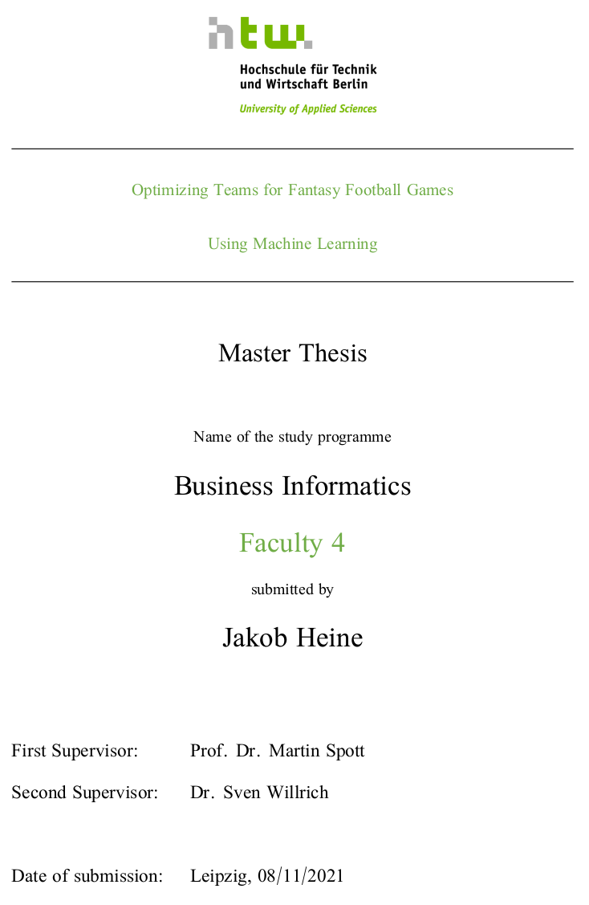

# Master Thesis LaTeX

For the creation of this thesis with LaTeX, the [LaTeX Master template](https://github.com/a-czyrny/LaTeX-Master-Vorlage) from [Alexander Czyrny](https://github.com/a-czyrny) was used, which is licensed under [Attribution-NonCommercial-ShareAlike 4.0 International](https://creativecommons.org/licenses/by-nc-sa/4.0?ref=chooser-v1). 

Furthermore, the template was translated and adjusted to own needs.

The thesis was written in *Visual Studio Code* using the required dependencies noted in [this guide](https://medium.com/@rcpassos/writing-latex-documents-in-visual-studio-code-with-latex-workshop-d9af6a6b2815).

