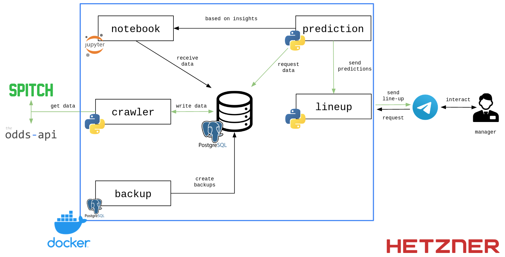

# Source Code Directory

This directory contains all code that was created in the course of the master's thesis. The application is implemented in a **microservice architecture**. All services are created as **Docker** containers. The entire tool is deployed on a **virtual private server** (VPS) hosted on Hetzner. The following figure shows the architecture and how the microservices interact with each other.



The green arrows indicate the primary process. In this process, the **Crawler** collects the current data from *SPITCH* and *the odds-api* via the **Proxy** and stores it in the **Database**. This data is then queried by the **Prediction** service, which predicts the individual scores of the players based on the findings from the **Jupyter Notebook** and forwards them to the **Lineup** service. The **Lineup** service creates the optimal line-up from the predicted scores and the transfer market values, which it then sends to the end-users via a **Telegram-Bot**. This process starts 15 minutes before the kick-off of a matchday so that the data is as up-to-date as possible, but the managers still have enough time to line up the team predicted by the tool. In addition, the manager can start the process himself at any time. Furthermore, the **Backup** service creates a backup of the database every 24 hours.

## Prerequisites

To deploy the application, only a server with:
- **Docker** 
- **Docker-Compose**,
- **Git**

installed is needed. 

Additionally, a `.env` file is needed containing the following **environment variables**:

| Variable          | Description |
|-------------------|-------------|
|POSTGRES_DB        |Name of the database           |
|POSTGRES_USER      |Name of the database user      |
|POSTGRES_PASSWORD  |Password of the database user  |
|TELEGRAM_TOKEN     |Token for the telegram bot     |
|JUPYTER_TOKEN      |Token for Jupyter Notebook     |
|ODDS_API_KEY       |API Key for the-odds-api       |

## Running the Application

After the **Github** repository has been cloned, the application can be started with the command: 

`docker-compose up`

With the help of **Docker-Compose**, each service is started as a Docker container. For this purpose, each Docker image is initially built once. A Python Virtual Environment (**venv**) is created in each service, which installs the previously defined dependencies in the `requirements.in`-file. 

When the system is initially started, all services are created and all data of the current season is stored in the database. If the system is shut down and restarted later, the old database is taken over and the services only request the missing information.

Each service is divided into a `main.py` and one or more other Python files. The `main.py` file contains only the **execution logic** of the services and calls methods from the other files.

## Running the Jupyter Notebook

The Jupyter Notebook can be started via **Docker** or **locally**. 

### Docker

When the application is running, it can be accessed via the following link: http://datascience-notebook:8888/JUPYTER_TOKEN

The Docker container has all needed dependencies already installed.

### Local

To run the Jupyter Notebook locally, `python3` is needed and the following steps are required:

1. Navigate to the notebooks directory:
```
cd ./notebooks/
```
2. Create venv:
```
python3 -m venv venv
```
3. Activate venv: 
```
source venv/bin/activate
```
4. Install pip-tools:
```
pip install pip-tools
```
5. Create requirements.txt from requirements.in:
```
pip-compile requirements.in
```
6. Install dependencies:
```
pip install -r requirements.txt
```

Furthermore, the notebook can be started in two ways, once with and once without access to the database. With the latter, the required data is loaded at the appropriate points by CSV files, which additionally leads to the notebook running faster. 

To switch between the two variants, the variable `use_csv` must be set to either `TRUE` or `FALSE` in the notebook.